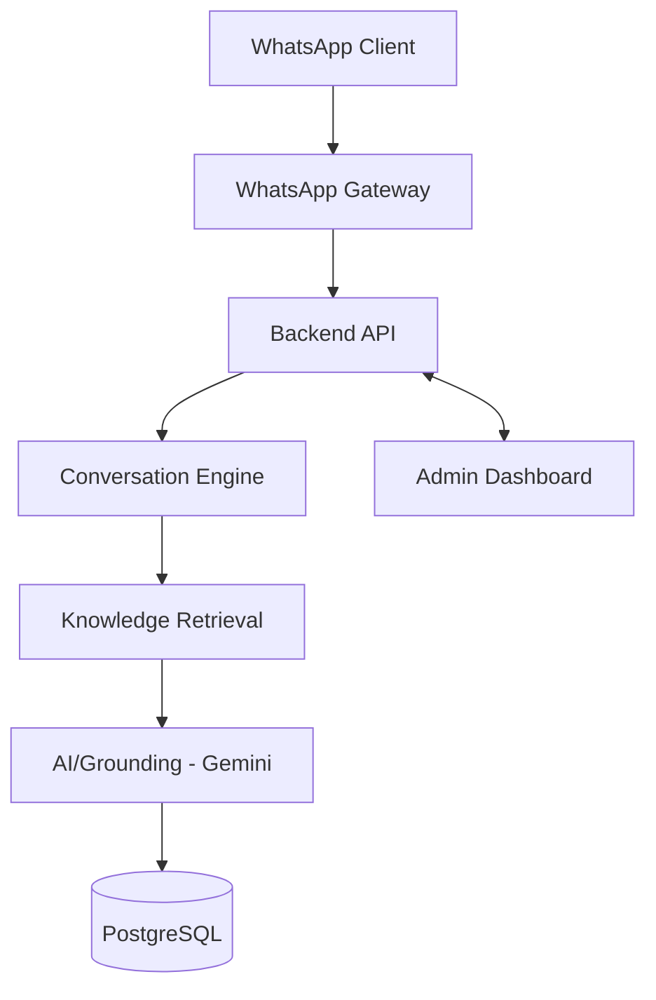

# TRD-TIVAsk-Revised.md

**Project:** TIVAsk | **Program:** Hackathon DIGIForward | **Tim:** Adaptiva
**Versi:** 1.1 (Simplified) | **Tanggal:** 10 September 2026

---

## 1. Technical Overview

TIVAsk terdiri dari 3 komponen: **WhatsApp Gateway** (whatsapp-web.js), **Backend API** (Node.js/Express/TypeScript + Prisma + PostgreSQL), **Admin Dashboard** (Next.js/React/TypeScript/Tailwind/shadcn). AI (Gemini) hanya dipakai sebagai reasoning layer di atas evidence dari Knowledge Base — bukan sumber pengetahuan.

## 2. System Architecture



> **Technical Decision:** WhatsApp Gateway dijalankan sebagai modul dalam backend yang sama (bukan service terpisah) untuk menyederhanakan deployment lokal.

## 3. Technology Stack

| Teknologi | Fungsi | Alasan | Risiko |
|---|---|---|---|
| Next.js/React/TS/Tailwind/shadcn | Admin Dashboard | Tim sudah familiar, cepat dibangun | — |
| Node.js/Express/TS | Backend API | Ringan & cepat untuk MVP | Perlu struktur disiplin |
| PostgreSQL + Prisma | Database & ORM | Data terstruktur, ORM cepat | Migration perlu hati-hati |
| Gemini | Grounding/response | Tim sudah punya akses | Bergantung koneksi internet |
| whatsapp-web.js | WhatsApp Gateway | Tanpa approval WA Business API | Sesi bisa terputus, perlu scan ulang |

Stack dipertahankan dari draft awal — tidak diganti hanya karena ada yang lebih baru.

## 4. Project Structure

```text
tivask/
  apps/
    backend/src/modules/{auth,knowledge-base,conversation,escalation,whatsapp-gateway,ai-grounding}
    frontend/app/{(auth)/login,(dashboard)/dashboard,knowledge-base,conversations,escalations}
  packages/shared/types
```

Frontend selalu mengakses data lewat backend API, tidak langsung ke database.

## 5. Backend Architecture

Route → Controller (validasi & response) → Service (business logic) → Prisma Client langsung (tanpa layer Repository terpisah, untuk mengurangi boilerplate).

Modul utama: Auth (JWT), Knowledge Base, Retrieval, AI Grounding, WhatsApp Service, Escalation. Middleware: auth guard, error handler global, logger sederhana.

## 6. Frontend Architecture

Halaman: `/login`, `/dashboard`, `/knowledge-base`, `/conversations`, `/escalations`. Route dashboard diproteksi via middleware yang cek token. Gunakan `react-hook-form` untuk form, `react-query` (atau setara) untuk fetching, dan setiap halaman list wajib punya loading/error/empty state. **Settings tidak diperlukan** untuk MVP.

## 7. Database Design

> **Technical Decision:** `MenuItem` dihilangkan sebagai entity terpisah — menu awal bot cukup jadi konstanta kode karena isinya statis.

```prisma
model AdminUser {
  id String @id @default(cuid())
  email String @unique
  passwordHash String
  escalations Escalation[]
}

model KnowledgeBaseEntry {
  id String @id @default(cuid())
  title String
  category String
  content String
  keywords String[]
  status KBStatus @default(DRAFT) // DRAFT | PUBLISHED | ARCHIVED
}

model Conversation {
  id String @id @default(cuid())
  phoneNumber String
  lastTopic String?
  lastCategory String?
  messages Message[]
  escalations Escalation[]
}

model Message {
  id String @id @default(cuid())
  conversationId String
  sender MessageSender // USER | BOT | ADMIN
  content String
  evidenceIds String[] // KB entry yang dipakai bot, untuk audit
}

model Escalation {
  id String @id @default(cuid())
  conversationId String
  status EscalationStatus @default(OPEN) // OPEN | RESOLVED
  handledById String?
}

model WhatsAppSession {
  id String @id @default("singleton")
  status String // connected | disconnected | needs_qr
}
```

## 8. API Contract (endpoint utama)

| METHOD | PATH | AUTH | Keterangan |
|---|---|---|---|
| POST | `/api/auth/login` | – | Login, kembalikan JWT |
| GET/POST | `/api/knowledge-base` | Ya | List & buat entri KB |
| PATCH | `/api/knowledge-base/:id` | Ya | Edit entri/status KB |
| GET | `/api/conversations` | Ya | List percakapan |
| GET | `/api/conversations/:id/messages` | Ya | Riwayat chat |
| GET | `/api/escalations` | Ya | List eskalasi |
| POST | `/api/escalations/:id/reply` | Ya | Balas ke WhatsApp user |
| PATCH | `/api/escalations/:id/resolve` | Ya | Tandai selesai |
| GET | `/api/whatsapp/status` | Ya | Status koneksi gateway |

Validasi standar: field wajib diisi, enum status valid; error 400 (input invalid), 401 (auth gagal), 404 (data tidak ditemukan).

## 9. Authentication

Login → verifikasi password (bcrypt) → terbitkan JWT (expiry ±8 jam) di HTTP-only cookie. Semua endpoint kecuali login butuh token valid. Single-role `Admin`, tanpa RBAC bertingkat.

## 10. Knowledge Base Design

Satu entri KB = satu unit informasi utuh dan spesifik (mis. "Biaya Seragam TKJ Laki-laki" terpisah dari "...Perempuan") — bukan digabung dalam satu entri besar. Ini mencegah retrieval mengambil evidence yang salah kategori/atribut.

## 11. Retrieval Strategy

Pendekatan: **hybrid keyword + category matching** (bukan semantic/vector similarity) — lebih deterministik dan mudah didebug untuk domain PPDB yang sempit dan spesifik.

```text
Pertanyaan → Normalize → Deteksi kategori & atribut (mis. jurusan, gender)
→ Filter entri KB Published pada kategori kandidat
→ Skor kecocokan keyword; atribut spesifik yang cocok diberi bobot lebih tinggi
→ Skor tertinggi & tidak ambigu? → pakai sebagai evidence
→ Ambigu / skor rendah? → fallback/klarifikasi (tidak menebak)
```

| Masalah | Penanganan |
|---|---|
| Chunk/informasi lintas-chunk | Tidak ada chunking — satu entri = satu unit utuh |
| Salah kategori/atribut | Skor mempertimbangkan kategori + atribut, bukan hanya kemiripan teks |
| Follow-up question | `lastTopic`/`lastCategory` di Conversation dipakai sebagai konteks default |
| Multiple record bersaing | Fallback/klarifikasi, bukan menebak |

> **Technical Decision:** Retrieval keyword+category dipilih ketimbang vector embedding karena domain sempit & waktu terbatas; vector search bisa jadi peningkatan Post-MVP.

## 12. AI / Grounding

AI (Gemini) hanya dipanggil **setelah** evidence valid ditemukan. Prompt berisi: pertanyaan user, evidence terpilih (title+content KB), riwayat singkat percakapan. Evidence ID dicatat di `Message.evidenceIds` untuk audit. Jika evidence tidak cukup → tidak panggil AI, langsung fallback → eskalasi.

## 13. Conversation Context (Follow-up)

`lastTopic`/`lastCategory` diperbarui setiap bot berhasil menjawab. Jika pertanyaan baru tidak menyebut topik eksplisit tapi mengganti atribut (mis. "kalau perempuan?"), sistem pakai `lastTopic` + atribut baru untuk retrieval. Jika pertanyaan menyebut topik baru, `lastTopic` lama diabaikan.

## 14. WhatsApp Gateway

- Hanya proses pesan teks dari chat pribadi (bukan grup `@g.us`, bukan self-message).
- Pesan non-teks dibalas pesan standar "belum didukung".
- Gunakan session persistence (LocalAuth) agar tidak perlu scan QR tiap restart.
- Modul terpisah dari business logic, komunikasi lewat interface sederhana (terima pesan → kembalikan balasan).

## 15. Testing Strategy

- **Unit:** fungsi intent detection, scoring retrieval, context resolution.
- **Integration/API:** endpoint auth, KB, escalations dengan DB test.
- **E2E (Playwright)** — critical journey: Login → KB Create/Edit/Delete → Conversations → Escalations → Manual Reply. Boleh mock pengiriman WhatsApp asli.
- **Full Integration:** minimal satu kali uji nyata pesan WA masuk → jawaban terkirim, dan eskalasi nyata muncul di dashboard.
- **AI Grounding Test:** known question (jawab benar), unknown question (fallback), ambiguous (fallback/klarifikasi), wrong category (tidak dijawab dengan entri salah), missing specific value (tidak diganti diam-diam), fabricated number (tidak boleh terjadi), follow-up (konteks dipertahankan), new subject (konteks lama tidak terbawa).
- **WhatsApp Workflow:** pesan grup/self diabaikan, media dibalas pesan standar, status koneksi akurat di dashboard.

## 16. UAT (ringkas)

Dilakukan manual setelah QA internal selesai, oleh anggota tim/guru yang tidak mengerjakan fitur terkait. Status: NOT TESTED / PASS / FAIL / BLOCKED.

| Persona | Skenario Utama |
|---|---|
| Orang tua | Buka percakapan; tanya info tersedia; tanya bahasa natural; follow-up; pertanyaan tidak tersedia (fallback) |
| Admin | Login; lihat dashboard; tambah/edit/nonaktifkan KB; lihat percakapan & eskalasi; balas & resolve eskalasi |

## 17. Recommended Implementation Order

| Phase | Fokus |
|---|---|
| 0 | Project foundation (setup repo, Prisma init) |
| 1 | Database & backend core (schema, health check) |
| 2 | Authentication (login, JWT, middleware) |
| 3 | Knowledge Base (CRUD) |
| 4 | Retrieval & Grounding (intent detection, scoring, Gemini) |
| 5 | WhatsApp Gateway (koneksi & handling pesan) |
| 6 | Conversations & Escalation (simpan chat, buat eskalasi) |
| 7 | Admin Frontend (dashboard terhubung API nyata) |
| 8 | Integration (uji sambung end-to-end) |
| 9 | Automated Testing (unit/integration/E2E/grounding) |
| 10 | UAT (uji manual non-developer) |
| 11 | Demo Preparation (cek koneksi & skenario demo) |

Setiap phase dianggap selesai jika deliverable-nya terhubung, teruji, dan memenuhi acceptance criteria FR terkait di PRD.

---

*Requirement produk (fitur, prioritas, acceptance criteria tingkat produk) ada di `PRD-TIVAsk-Revised.md`.*
